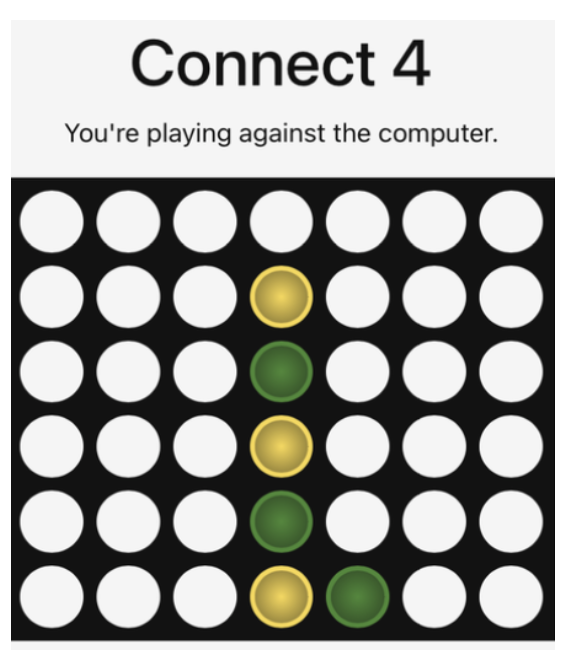

---
title: "Connect 4 Against AI: The Effect of Human Strategy on Gameplay"
author: "Nabiha Chowdhury"
format:
  html:
    toc: true
    code-fold: true
    code-tools: true
---

## Abstract

This study examines whether human gameplay strategy influences outcomes and game length when playing Connect 4 against an AI opponent. Two strategies were compared: a normal strategy focused on balancing offensive and defensive moves, and a defensive strategy focused primarily on blocking the opponent. Forty games were conducted under standardized conditions, with 20 games played using each strategy. Game outcome and the number of human moves were recorded and analyzed using Fisher's exact test and one-way ANOVA. The analysis found no statistically significant association between strategy and game outcome ($p = 1.00$). However, strategy was significantly associated with the number of human moves made during a game ($p = 0.0252$). Defensive gameplay resulted in an average of 15.95 human moves compared with 13.00 moves under the normal strategy. These results suggest that while strategy did not significantly affect whether the human player won or lost, defensive play was associated with longer games.

## 1. Introduction

Strategic decision-making is an important component of interactions between humans and expert systems. Games provide a controlled environment for examining these interactions because the rules, objectives, and system behavior can be standardized across repeated trials.

This study investigates how different human strategies influence gameplay when competing against an AI opponent in Connect 4. Specifically, two approaches were compared: a **normal strategy**, in which the player balances offensive and defensive moves while attempting to win, and a **defensive strategy**, in which the player prioritizes blocking the AI opponent.

The primary research question is:

> **How does a human player's strategy influence game outcomes and game length when competing against an AI opponent in Connect 4?**

Two outcomes were examined: whether the human player won or lost the game, and the number of moves made by the human player.

## 2. Experimental Design

### 2.1 Game Environment

The experiment used an online Connect 4 game played against an AI opponent. The same AI opponent, difficulty level, and default system settings were used throughout the experiment.

To maintain consistency across trials:

- The same AI opponent was used for every game.
- Default difficulty and system settings were maintained.
- The human player made the first move.
- The game followed a standard turn-based format.
- The board was configured identically for each trial.
- The game was refreshed and reset between trials.

### 2.2 Strategies

The explanatory variable was the human player's gameplay strategy.

**Normal strategy:** The player attempted to win by balancing offensive and defensive moves.

**Defensive strategy:** The player prioritized preventing the AI from winning by focusing on blocking moves.

Twenty games were played using each strategy, resulting in **40 total trials**.

### 2.3 Response Variables

The primary response variables were:

- **Game outcome:** whether the human player won, lost, or drew.
- **Number of human moves:** the total number of moves made by the human player during a game.

Additional gameplay information, including the number of AI moves and the number of spaces remaining on the board at the end of each game, was also recorded.

### 2.4 Potential Confounding Factors

Several factors could influence gameplay in addition to the strategy being tested. Human skill, concentration, fatigue, and familiarity with the AI could change across repeated trials. The AI may also make different moves between games, even under identical settings.

Because the experiment involved repeated gameplay by human participants, learning effects may also have occurred. Players could become more familiar with the AI's behavior over time, potentially affecting later outcomes.

## 3. Data and Analysis

A total of 40 Connect 4 trials were recorded. The resulting dataset contained the following variables:

| Variable | Description |
|---|---|
| `strategy` | Human gameplay strategy: normal or defensive |
| `game_outcome` | Game result: win, loss, or draw |
| `num_of_AI_moves` | Number of moves made by the AI |
| `num_of_human_moves` | Number of moves made by the human |
| `spaces_left` | Number of empty spaces remaining at the end of the game |

Two statistical approaches were used.

### Fisher's Exact Test

Fisher's exact test was used to examine whether human strategy was associated with game outcome.

The hypotheses were:

- **H₀:** There is no association between human strategy and game outcome.
- **Hₐ:** There is an association between human strategy and game outcome.

The two draw observations were excluded from this analysis because the comparison focused on wins and losses.

### One-Way ANOVA

A one-way ANOVA was used to compare the mean number of human moves between the normal and defensive strategies.

The hypotheses were:

- **H₀:** The mean number of human moves is the same under both strategies.
- **Hₐ:** The mean number of human moves differs between strategies.

The two draw observations were excluded from the analysis.

## 4. Results

### 4.1 Game Outcomes

Across the 40 trials, the human player won 5 games, lost 33 games, and drew 2 games. After excluding the two draws, 38 games remained for the win/loss analysis.

Fisher's exact test produced a **p-value of 1.00**.

Because this p-value is greater than the 0.05 significance level, we fail to reject the null hypothesis. The results do not provide evidence of a statistically significant association between human gameplay strategy and game outcome.

In this sample, changing from a normal to a defensive strategy did not produce a statistically detectable difference in the probability of winning or losing against the AI.

### 4.2 Game Length

The number of human moves was used as a measure of game length.

Games played using the defensive strategy averaged **15.95 human moves**, compared with **13.00 human moves** for games played using the normal strategy.

The one-way ANOVA produced a **p-value of 0.0252**.

Because this result is below the 0.05 significance level, we reject the null hypothesis. The analysis provides evidence that the mean number of human moves differs between the two strategies.

In this experiment, defensive gameplay was associated with longer games.

## 5. Interpretation

The results provide different conclusions for the two outcomes examined.

First, the strategy used by the human player did not have a statistically significant relationship with game outcome. Across the 38 non-draw games, only five resulted in human victories, suggesting that the AI opponent was generally more successful than the human players in this experiment. However, the Fisher's exact test did not provide evidence that the choice between normal and defensive gameplay changed the likelihood of winning or losing.

Second, strategy was significantly associated with game length. Defensive gameplay produced an average of approximately three additional human moves per game compared with normal gameplay. This suggests that prioritizing defensive moves may prolong gameplay even when it does not increase the likelihood of winning.

The distinction between these findings is important: **a strategy can influence how a game unfolds without necessarily improving its final outcome.**

## 6. Limitations

Several limitations should be considered when interpreting these findings.

### Human Skill and Learning

The players conducting the experiment were not expert Connect 4 players. Differences in skill, concentration, and familiarity with the game could influence the results. Repeated gameplay may also allow players to learn patterns in the AI's behavior, creating potential learning effects across trials.

### AI Behavior

Although the same AI system and difficulty settings were used throughout the experiment, the AI's moves may vary between individual games. The AI may also respond differently depending on the moves made by the human player, making it difficult to completely isolate the effect of human strategy.

### Sample Size

The experiment included 40 games, with 20 games under each strategy. A larger number of trials would provide more observations and could produce more reliable estimates of differences in game outcomes and game length.

### Strategy Definition

The distinction between "normal" and "defensive" gameplay was based on behavioral rules rather than a fully automated strategy. Human decision-making may therefore have varied somewhat between trials.

### Draws

Two games ended in draws and were excluded from the win/loss and ANOVA analyses. While this allowed the statistical comparisons to focus on the primary outcomes of interest, excluding observations reduces the amount of available data.

## 7. Conclusion

This experiment examined whether human gameplay strategy affects outcomes and game length when competing against an AI opponent in Connect 4.
 
The results did not provide evidence of a statistically significant association between strategy and game outcome. However, strategy was significantly associated with the number of human moves made during a game. Defensive gameplay resulted in longer games on average, with 15.95 human moves compared with 13.00 under the normal strategy.

These findings suggest that defensive play may alter the dynamics and duration of human-AI gameplay without necessarily improving the probability of winning. More trials, more controlled player behavior, and automated strategy implementation could provide a stronger basis for evaluating how different human strategies interact with AI decision-making.