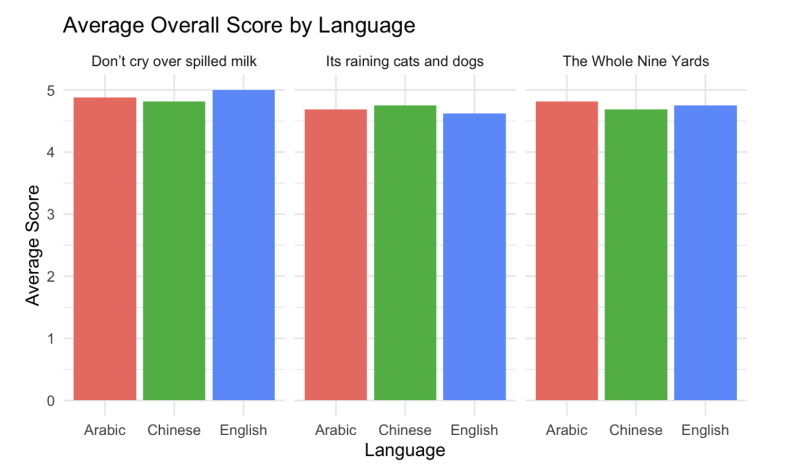
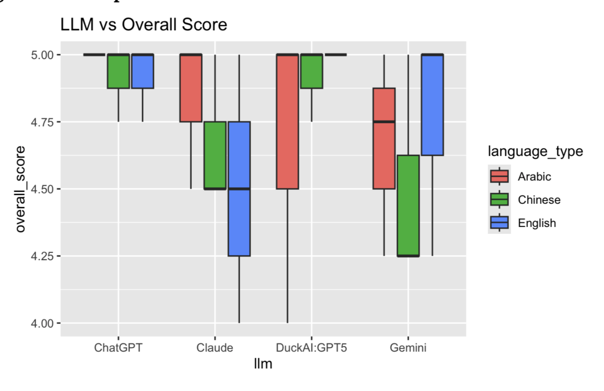

---
title: "Multilingual LLM Evaluation: Idiom Interpretation and Translation"
author: "Nabiha Chowdhury"
format:
  html:
    toc: true
    code-fold: true
    code-tools: true
---

## Abstract

Large language models are increasingly used for multilingual communication and translation, but their ability to preserve meaning across languages can vary depending on the task and cultural context. This study evaluates how multiple large language models interpret and translate common English idioms across English, Arabic, and Chinese.

Four LLMs—ChatGPT, Gemini, Claude, and DuckAI:GPT5—were evaluated using three English idioms translated into the three test languages. Responses were evaluated by two additional LLMs, Microsoft Copilot and Meta AI, which independently scored translation accuracy and the correctness of the reported idiom origin on a 1–5 scale. Overall scores were analyzed using one-way ANOVA to examine differences across languages and across the four LLMs.

The analysis found no statistically significant difference in overall scores across languages ($p = 0.94$) or across the LLMs tested ($p = 0.114$). Although the experiment found high scores overall, the results should be interpreted cautiously due to the small number of idioms, reliance on machine translation, and use of LLMs as evaluators.

## 1. Introduction

Large language models (LLMs) are increasingly capable of generating and translating text across languages. However, idiomatic expressions present a particular challenge because their meanings often cannot be inferred directly from the individual words that make up a phrase.

This study examines how LLMs interpret common English idioms when the idioms are presented in different languages. Specifically, the experiment evaluates four LLMs across English, Arabic, and Chinese using three common English idioms:

- "It's raining cats and dogs"
- "Don't cry over spilled milk"
- "The whole nine yards"

The primary research question is:

> **How does LLM performance in interpreting idioms differ across languages and across different large language models?**

The study evaluates two aspects of model responses: the accuracy of the idiom's meaning or translation and the accuracy of the reported origin of the idiom. Responses were evaluated using two additional LLMs as judges.

## 2. Experimental Design

### 2.1 Models and Systems

The experiment involved six AI systems:

**LLMs evaluated:**

- ChatGPT
- Google Gemini
- Claude
- DuckAI:GPT5

**LLMs used as evaluators:**

- Microsoft Copilot
- Meta AI

Google Translate was used to translate the selected idioms between languages before they were presented to the tested LLMs.

### 2.2 Experimental Conditions

To maintain consistency across trials, the following conditions were held constant:

- The same prompt structure was used across models.
- Reference chat history was disabled.
- The context window was cleared between trials.
- Models were reset between prompts.
- Responses were evaluated using a 1–5 scoring scale.

The primary explanatory variables were **language** and **LLM**.

The three languages evaluated were:

- English
- Arabic
- Chinese

The four LLMs evaluated were ChatGPT, Gemini, Claude, and DuckAI:GPT5.

The response variables were the scores assigned to each model response for:

- Idiom translation/meaning accuracy
- Idiom origin accuracy
- Overall score, calculated as the mean of the two scores

### 2.3 Idiom Selection

Three common English idioms were selected:

| Idiom | General Meaning |
|---|---|
| It's raining cats and dogs | It is raining very heavily |
| Don't cry over spilled milk | Do not dwell on something that has already happened |
| The whole nine yards | Everything or the complete amount |

Each idiom was evaluated in English, Arabic, and Chinese.

### 2.4 Data Collection

Each of the four LLMs was prompted with each of the three idioms in each of the three languages, producing:

$$
4 \times 3 \times 3 = 36
$$

LLM responses.

Each response was then evaluated by both Copilot and Meta AI, producing:

$$
36 \times 2 = 72
$$

total scored observations.

The primary prompt used to evaluate each idiom was:

> "What does [idiom] mean and where does it originate?"

The resulting response was then provided to the judge LLMs with instructions to assign separate scores for origin and translation accuracy on a 1–5 scale.

### 2.5 Scoring

Each response received two scores:

- **Origin accuracy:** How accurately the model identified the idiom's origin.
- **Translation accuracy:** How accurately the model interpreted or translated the idiom.

An overall score was calculated as:

$$
\text{Overall Score} =
\frac{\text{Origin Score} + \text{Translation Score}}{2}
$$

Higher scores indicate greater evaluated accuracy.

## 3. Hypotheses

### ANOVA: Overall Score vs. Language

**Null hypothesis ($H_0$):**  
There is no difference in mean overall score among the three languages.

**Alternative hypothesis ($H_A$):**  
At least one language has a different mean overall score.

### ANOVA: Overall Score vs. LLM

**Null hypothesis ($H_0$):**  
There is no difference in mean overall score among the four LLMs.

**Alternative hypothesis ($H_A$):**  
At least one LLM has a different mean overall score.

## 4. Results

### 4.1 Overall Score by Language

A one-way ANOVA was conducted to determine whether mean overall scores differed across English, Arabic, and Chinese.

The analysis produced a **p-value of 0.94**.

Because this p-value is substantially greater than the 0.05 significance level, we fail to reject the null hypothesis. The results do not provide evidence of a statistically significant difference in overall scores across the three languages.

The scores were generally high across all three languages. However, the lack of a statistically significant result does not establish that the models perform identically across languages; rather, the experiment did not detect a significant difference given the available data.

### 4.2 Overall Score by LLM

A second one-way ANOVA examined whether mean overall scores differed among ChatGPT, Gemini, Claude, and DuckAI:GPT5.

The analysis produced a **p-value of 0.114**.

Because this p-value is greater than the 0.05 significance level, we fail to reject the null hypothesis. The results do not provide evidence of a statistically significant difference in mean overall score among the four LLMs tested.

Although some models showed greater variation in their scores than others, the observed differences were not statistically significant in this experiment.

## 5. Interpretation

Across the 72 scored observations, the models generally received high evaluation scores for interpreting and translating the selected idioms.

The language comparison did not produce statistically significant evidence of differences in overall performance. Similarly, the comparison among the four LLMs did not produce statistically significant evidence that one model had a different mean score from the others.

These findings suggest that, for the three common English idioms examined in this experiment, substantial differences in evaluated performance were not detected across the tested languages or LLMs.

However, the results should not be interpreted as evidence that LLMs are equally capable across all languages or idiomatic expressions. The experiment focused on a very small set of common English idioms, and the statistical power of the analysis is limited by the sample size and experimental design.

An additional observation was that translation scores were generally high, while origin scores showed more variation. This suggests that identifying the general meaning of a common idiom may be easier for these models than providing a consistently accurate account of its historical origin.

## 6. Limitations

### Limited Number of Idioms

Only three English idioms were included in the experiment. Because idioms vary substantially in cultural specificity, complexity, and ambiguity, the results may not generalize to other expressions.

### Reliance on Machine Translation

Google Translate was used to translate the original idioms into Arabic and Chinese. This introduces an additional layer of uncertainty because the translated phrase may not represent a culturally equivalent idiom in the target language.

### Language Familiarity

Neither researcher was fluent in Arabic or Chinese. As a result, the experiment relied on machine translation and LLM-generated interpretations when evaluating responses in these languages.

### LLM-Based Evaluation

The responses were scored by Copilot and Meta AI rather than exclusively by human experts. LLM-based judges may introduce their own biases or inconsistencies when evaluating the accuracy of another model's response.

### Sample Size

The experiment produced 72 scored observations, but these observations were generated from only three idioms and four tested LLMs. A larger experiment containing more idioms, languages, and repeated trials would provide stronger evidence.

## 7. Conclusion

This study evaluated the ability of four large language models to interpret and translate three common English idioms across English, Arabic, and Chinese.

Neither language nor LLM produced a statistically significant difference in overall evaluation scores. The language comparison produced a p-value of 0.94, while the LLM comparison produced a p-value of 0.114.

The findings indicate that meaningful differences in evaluated performance were not detected within the specific conditions of this experiment. However, the limited number of idioms, reliance on machine translation, and use of LLMs as evaluators restrict the generalizability of the findings.

A larger follow-up study could expand the number and types of idioms, include additional languages and models, and incorporate human evaluators to provide a more robust assessment of multilingual LLM performance.